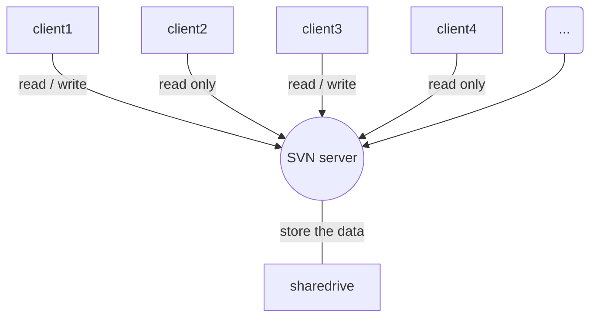

## 标题

# abcde

# abcde

**你好**

\# jump


|      |      |      |
| :--- | ---- | ---- |
| 行1  | 列2  | 列3  |

```flow
// 流程图 flow
st=>start: Start
op=>operation: Your Operation
cond=>condition: Yes or No?
e=>end
st->op->cond
cond(yes)->e
cond(no)->op
```



```sequence
Title:连接建立的过程
客户主机->服务器主机: 连接请求（SYN=1,seq=client_isn） 
服务器主机->客户主机: 授予连接（SYN=1,seq=client_isn）\n ack=client_isn+1
客户主机->服务器主机: 确认（SYN=0,seq=client_isn+1）\nack=server_isn+1
```

```java
public void test(String param){
    System.out.println("hello");
}
```

[alt_content](#jump)


<link rel="stylesheet" href="//cdn.bootcss.com/gitalk/1.5.0/gitalk.min.css">
<script src="//cdn.bootcss.com/gitalk/1.5.0/gitalk.min.js"></script>
<div id="gitalk-container"></div>
<script>
    var gitalk = new Gitalk({
    clientID: '2973ef78e3817bb9904d', // GitHub Application Client ID
    clientSecret: 'f22ec25fbf86e712c8bd05e5b30607d809c9a658', // GitHub Application Client Secret
    repo: 'dituhui-gitbook',              // 存放评论的仓库
    owner: 'chamberone',          // 仓库的创建者，
    admin: ['chamberone'],        // 如果仓库有多个人可以操作，那么在这里以数组形式写出
    id: "/test.md",      // 用于标记评论是哪个页面的，确保唯一，并且长度小于50
    title: "test反馈" //title用于在github仓库issues的标题，如果你想管理评论可以设置一下这个参数，来区分该评论是来自于那个文章
    });
    gitalk.render('gitalk-container');    // 渲染Gitalk评论组件
 </script>